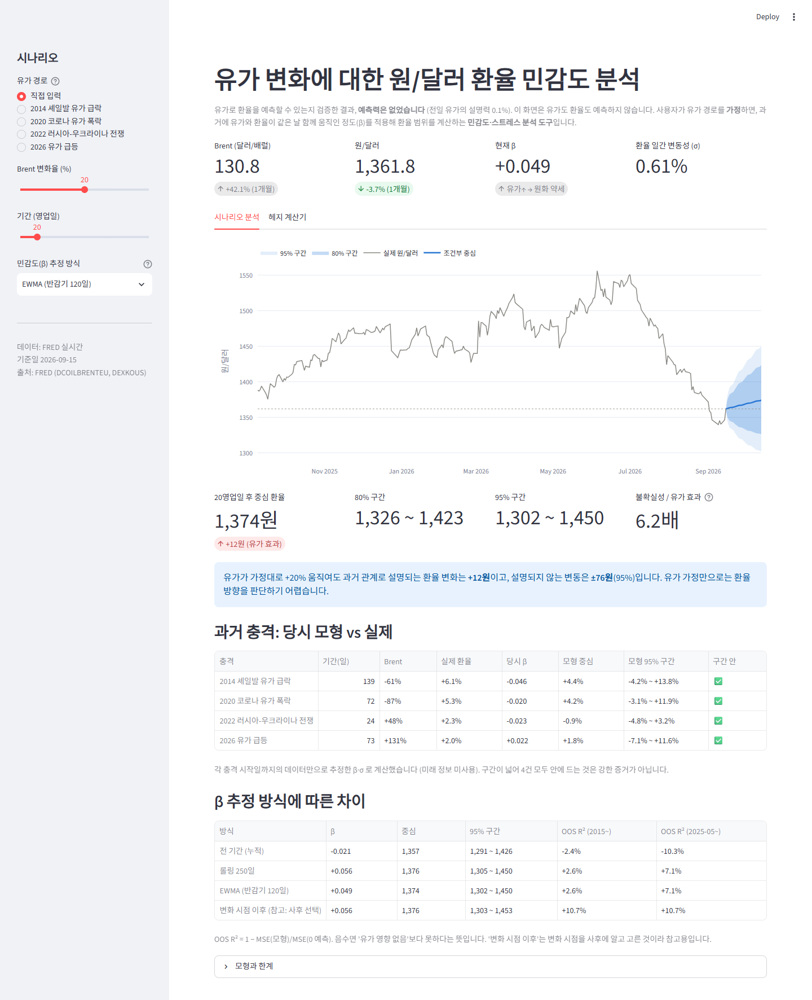
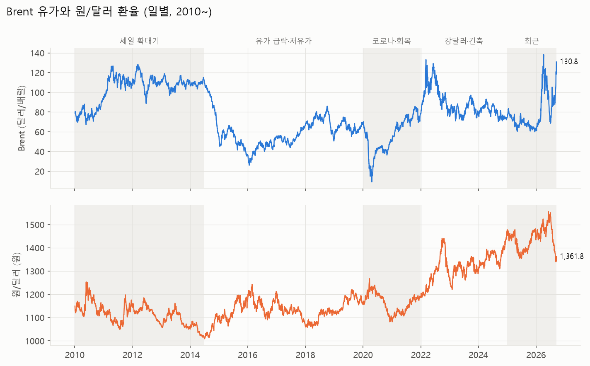
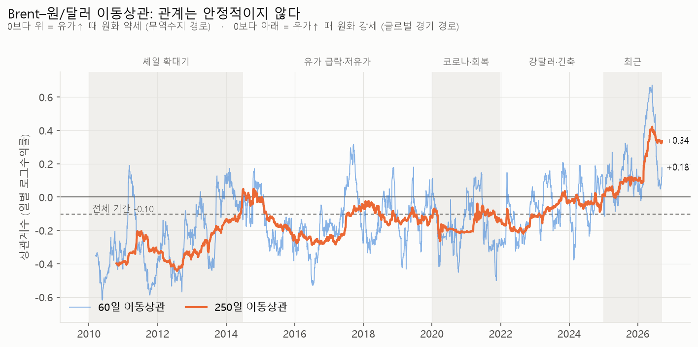
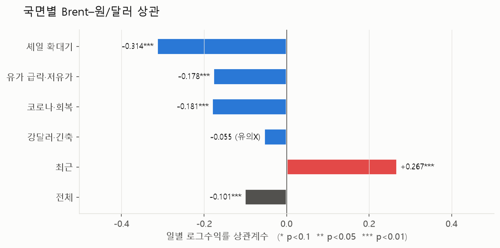
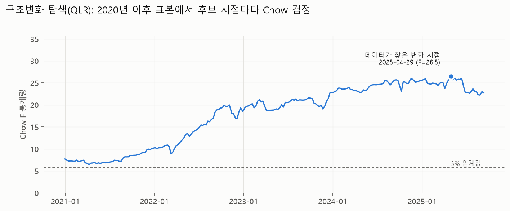
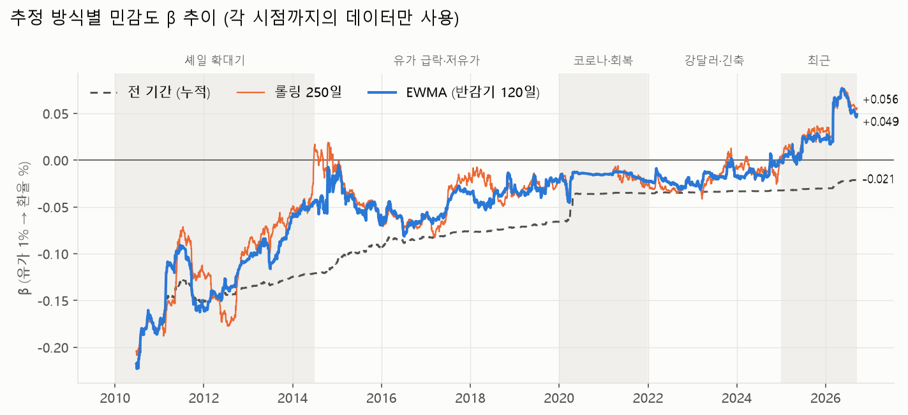
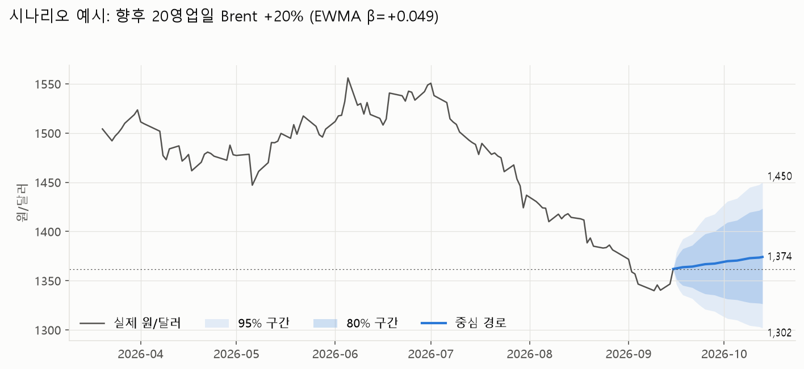
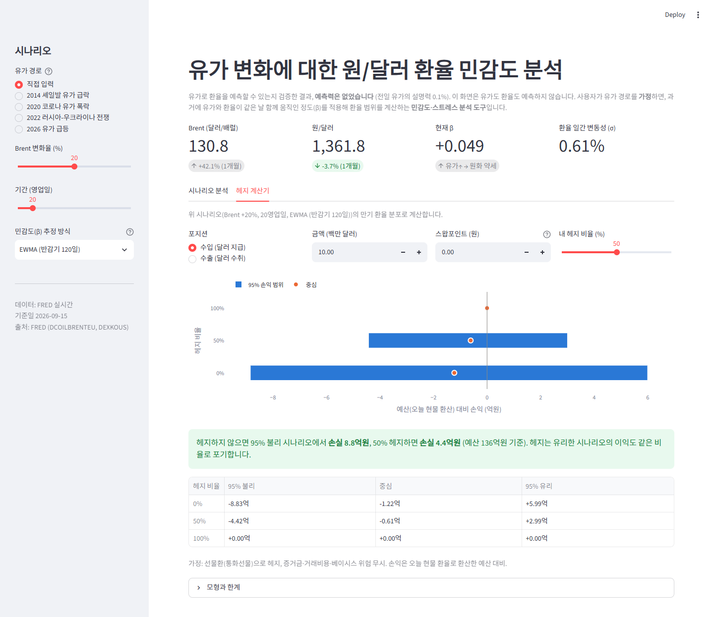

# 유가–원/달러 환율 시나리오 대시보드

> 국제유가가 원/달러 환율에 주는 영향을 통계적으로 검정하고,
> 확인된 관계로 **유가 시나리오별 환율 위험 범위**와 **헤지 효과**를 보여주는 대시보드

**라이브 데모:** https://oil-fx-dashboard-9kwlwhhrwz8bejyxg9xqgg.streamlit.app/

> 접속자가 없으면 Streamlit Cloud가 앱을 잠재웁니다. "Yes, get this app back up!"을 누르면 1분 안에 다시 켜집니다.



## 핵심 결론

1. **관계의 방향이 바뀌었다.** 2010~2024년에는 유가가 오를 때 원화가 강해졌지만(상관 -0.10),
   2025년 이후에는 원유 수입국답게 원화가 약해진다(+0.27). QLR 검정이 **2025-04-29**를 구조변화 시점으로 스스로 찾아냈다.
2. **유가는 환율을 미리 알려주지 않는다.** 두 변수는 같은 날 함께 움직일 뿐, 전날 유가로 환율을 예측하는 설명력은 0.1%다.
   그래서 이 대시보드의 "예측"은 **유가가 X% 움직일 때 환율 분포에 대한 조건부 시나리오**다.
3. **유가 효과보다 환율 자체의 불확실성이 크다.** Brent +20%(20영업일) 시 환율 중심은 +12원 움직이지만 95% 구간은 ±76원이다.
   유가 전망만으로 환율 방향에 베팅하기보다 **범위를 관리(헤지)** 해야 한다.

---

## 1. 문제 정의
- 한국은 원유 순수입국이다. 유가가 오르면 무역수지가 나빠지고 달러 수요가 늘어 **원화 약세** 압력이 생긴다 (무역수지 경로).
- 반면 세계 경기가 좋을 때는 유가 상승과 위험자산 선호가 함께 나타나 **원화 강세**가 되기도 한다 (글로벌 경기 경로).
- **질문:** 두 경로 중 어느 쪽이 우세한가? 그 관계는 안정적인가? 예측에 쓸 만큼 유의한가?

## 2. 데이터
| 변수 | 출처 | 주기 | 비고 |
|---|---|---|---|
| Brent, WTI | FRED (DCOILBRENTEU, DCOILWTICO) | 일별 | 인증키 불필요 |
| 원/달러 | FRED (DEXKOUS) | 일별 | 뉴욕 정오 기준 |
| Dubai *(선택)* | 한국은행 ECOS 902Y003 | 월별 | `.env`에 ECOS 키가 있으면 자동 추가 |

- 기간: 2010-01 ~ 현재 (일별 4,116일), 국면 5개로 나눠 비교
- **휴일 결측을 앞 값으로 채우지 않았다.** 채우면 수익률이 0인 날이 인위적으로 생겨 상관이 과소추정된다. 유가와 환율이 모두 관측된 날만 쓴다.
- 2020-04-20 WTI 마이너스 가격은 로그를 취할 수 없어 제외하고, 기준 유종은 Brent로 정했다. (정제 기록: `data/processed/cleaning_log.txt`)

## 3. 분석 흐름
| 단계 | 방법 | 판단 |
|---|---|---|
| 탐색 | 이동상관(60·250일), 국면별 상관 | 관계가 안정적인가? |
| 검정 | ADF, Engle-Granger 공적분, 그레인저 인과(HAC), 시차 상관, Chow·QLR | 수준/수익률 중 무엇으로? 선행하는가? 언제 바뀌었나? |
| 모형 | 시변 β 수익률 회귀 (전 기간·롤링·EWMA), 워크포워드 표본 밖 검증 | 어떤 β가 실제로 잘 맞히나? |
| 대시보드 | 시나리오 밴드, 과거 충격 사후검증, 헤지 계산기 | 의사결정에 어떻게 쓰나? |

## 4. 결과

### 4-1. 탐색: 관계는 안정적이지 않다




| 국면 | 기간 | 일별 상관 | 유의성 |
|---|---|---|---|
| 셰일 확대기 | 2010-01 ~ 2014-06 | -0.31 | 유의 |
| 유가 급락·저유가 | 2014-07 ~ 2019-12 | -0.18 | 유의 |
| 코로나·회복 | 2020-01 ~ 2021-12 | -0.18 | 유의 |
| 강달러·긴축 | 2022-01 ~ 2024-12 | -0.06 | 유의하지 않음 |
| **최근** | 2025-01 ~ 2026-09 | **+0.27** | 유의 |
| 전체 | 2010-01 ~ 2026-09 | -0.10 | 유의 |

- 250일 이동상관은 -0.44 ~ +0.42 사이를 오가고, 양(+)인 기간은 14%뿐이다.
- 전 기간 하나의 계수로 예측하면 현재 국면을 잘못 반영한다.

### 4-2. 통계 검정: 같은 날 움직이고, 최근에 바뀌었다
| 검정 | 결과 | 모형 설계에 주는 의미 |
|---|---|---|
| ADF 단위근 | 로그 수준은 두 변수 모두 비정상, 로그수익률은 정상 | 수준끼리 회귀하면 허구적 회귀 → **수익률로 분석** |
| Engle-Granger 공적분 | 전체 기간 p=0.81~0.90. 국면 6개 중 1개만 경계선(p=0.047) | 장기 균형관계 없음 → **오차수정모형(ECM) 미사용** |
| 그레인저 인과 (HAC) | 유가→환율 유의(p=0.006), 역방향 유의하지 않음. **설명력 R² 0.13%** | 통계적으로 선행하지만 **예측력은 경제적으로 무의미** |
| 시차 상관 | 같은 날(k=0)에 집중. 하루라도 어긋나면 ±0.04 이내 | 관계는 같은 날 반영 → **조건부 시나리오 모형** |
| Chow (2025-01 사전 지정) | β -0.032 → +0.053, HAC p<0.001 | 그래프를 보고 고른 시점이라 **데이터 스누핑 위험** → QLR로 보완 |
| QLR (2020년 이후 표본) | sup-F 26.5 (5% 임계값 5.86), **변화 시점 2025-04-29를 데이터가 스스로 찾음** | 전환은 실재함. 다만 F가 2022년부터 서서히 올라 **점진적 이동**에 가까움 |



> 전체 표본으로 QLR을 돌리면 15% 트리밍 규칙 때문에 2025년이 후보에서 빠진다. 그래서 2020년 이후 표본으로 다시 탐색했다.

### 4-3. 모형과 표본 밖 검증
**모형:** `r_fx,t = β_t · r_oil,t + ε_t` (일별 로그수익률, 원점 통과). β_t와 σ_t는 **t-1일까지의 데이터로만** 추정한다.
2015년부터 하루씩 앞으로 옮겨가며 검증했고(워크포워드), 기준선은 "유가 영향 없음(0 예측)"이다.

| 방식 | 일별 OOS R² (2015~) | 일별 OOS R² (2025-05~) | 큰 유가 변동 시 방향 적중 (2025-05~) | 95% 구간 커버리지 |
|---|---|---|---|---|
| 전 기간 (누적) | **-2.4%** | **-10.3%** | 31% | 94.0% |
| 롤링 250일 | +2.6% | +7.1% | 69% | 93.6% |
| **EWMA 반감기 120일 (채택)** | **+2.6%** | **+7.1%** | **69%** | 93.9% |
| 변화 시점 이후 (사후 선택, 참고용) | – | +10.7% | 68% | 95.0% |

- **전 기간 β는 0 예측보다 나쁘다.** 관계가 변하는 상황에서 과거 평균은 틀린 방향을 가리킨다.
- **EWMA를 채택한 이유:** 성과가 가장 좋고, 반감기 120일은 결과를 보기 전에 정했다. 반감기 60~250일에서 성과가 거의 같아 파라미터 선택에 민감하지 않다.
- **구간이 정직하다:** 95% 구간이 실제 변화의 93.9%를 포함한다. 조금 모자란 것은 환율 수익률의 꼬리가 정규분포보다 두껍기 때문이다.
- **기간을 주·월 단위로 늘리면 R²가 0에 가까워진다.** 유가는 환율의 중기 경로를 설명하지 못한다. 대시보드의 가치는 중심선보다 **구간(위험 범위)** 에 있다.




### 4-4. 대시보드


| 기능 | 내용 |
|---|---|
| 시나리오 예측 | Brent 변화율·기간·β 방식을 고르면 원/달러 중심 경로와 80%/95% 구간 |
| 과거 충격 프리셋 | 2014 급락, 2020 코로나, 2022 전쟁, 2026 급등을 오늘에 적용하고, **당시 데이터만으로 낸 예측과 실제 결과**를 비교 |
| 헤지 계산기 | 수입/수출 달러 포지션 × 헤지 비율별 95% 손익 범위 |
| 데이터 갱신 | 접속 시 FRED에서 갱신(6시간 캐시), 실패하면 저장된 CSV로 대체 |

과거 충격 4건 모두 실제 환율이 모형의 95% 구간 안에 들어왔다. 다만 구간이 넓어 강한 증거는 아니고, **2022년 전쟁 때는 중심 방향이 틀렸다**(모형 -0.9%, 실제 +2.3%).

## 5. 한계
- **단일 요인 모형:** 달러 인덱스, 한미 금리차, 외국인 증권자금 같은 핵심 환율 요인이 빠져 있다. 2026년 9월 유가 급등기에 원화가 오히려 강해진 것도 이 모형으로는 설명되지 않는다.
- **정규분포 가정:** 꼬리 위험을 과소평가한다 (95% 커버리지 93.9%).
- **환율 기준 시각:** FRED 원/달러는 뉴욕 정오 기준이라 서울 외환시장 종가와 다르다.
- **유가 경로는 사용자 가정:** 유가 자체를 예측하지 않는다.
- **구조변화 원인은 미확인:** 2025년 4월 전후로 관계가 바뀐 원인(관세 충격, 공급 충격 등)은 검정하지 않았다.
- **헤지 계산 단순화:** 스왑포인트는 입력값이고(기본 0), 증거금·거래비용·베이시스 위험은 무시했다.

## 6. 시사점과 향후 과제
- **실무 시사점:** 유가 급등기에도 환율 방향은 확신할 수 없다. 원유 수입업체라면 유가 전망보다 환율 **범위**를 기준으로 헤지 비율을 정하는 편이 합리적이다.
- **선물 커브 연동:** 유가 경로를 사용자가 직접 넣는 대신, 유가 선물 가격(예: NH선물 API)에서 시장이 예상하는 경로를 받아 시나리오에 쓴다.
- **다요인 확장:** 달러 인덱스와 금리차를 추가하고, 국면 전환 모형(Markov switching)으로 β의 변화를 직접 모형화한다.
- **꼬리 위험:** t분포나 GARCH로 구간을 보정한다.
- **Dubai 유가:** ECOS 키를 연동해 한국 도입 원유 기준으로 재검증한다.

## 7. 프로젝트 구조
```
app.py              Streamlit 대시보드
run_explore.py      2단계 탐색 (이동상관, 국면별 상관)
run_tests.py        3단계 검정 (ADF, 공적분, 그레인저, Chow, QLR)
run_model.py        4단계 모형 추정·워크포워드 검증
src/
  sources/          FRED·ECOS 수집과 캐시
  data.py           정제 (휴일 결측, 마이너스 유가, 미완결 월)
  explore.py        이동상관·국면별 통계
  econ.py           통계 검정
  model.py          시변 β, 워크포워드, 시나리오, 과거 충격 사후검증
  hedge.py          헤지 손익 계산
  figures.py        보고서용 그래프
data/processed/     정제 데이터 (대시보드 백업용)
output/             그래프와 결과표
tests/test_app.py   대시보드 스모크 테스트
```

## 8. 실행
```bash
pip install -r requirements.txt
streamlit run app.py

# 분석 재현
python run_explore.py
python run_tests.py
python run_model.py
python -m pytest tests
```
